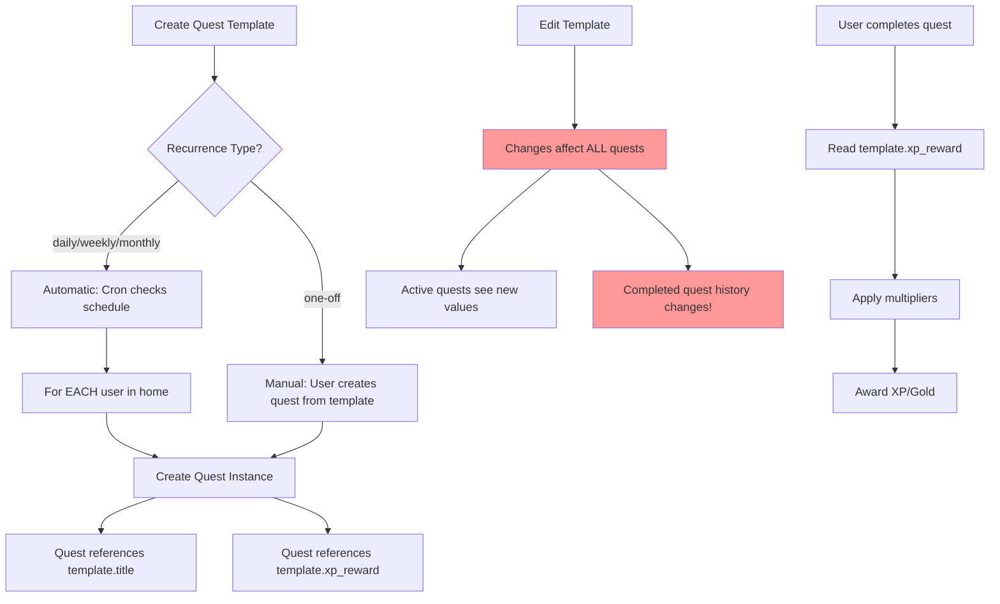
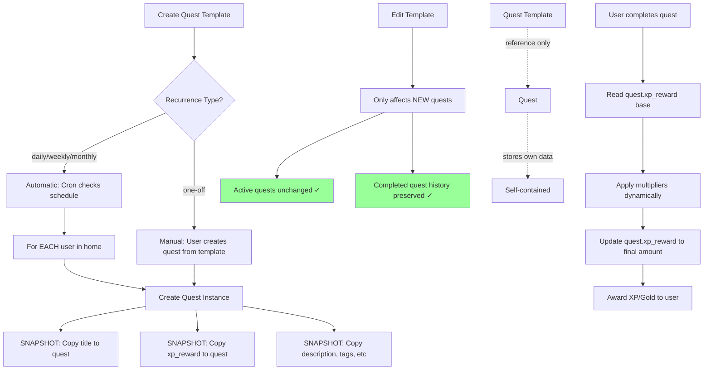
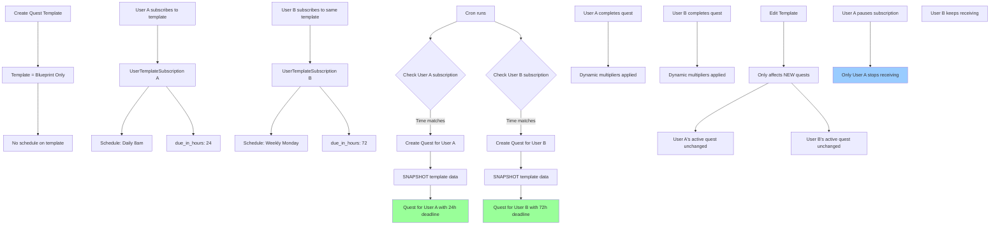

# Quest Template Workflow Diagrams

This document visualizes how quest templates spawn quest instances across different implementation phases.

## Current Workflow (Before Phase 1)

**Problems:**
- 🔴 Editing templates changes active quests
- 🔴 Quest history is not preserved (shows current template values)
- 🔴 Quests are not self-contained

---

## After Phase 1: Snapshot Pattern

**Benefits:**
- ✅ Quests are self-contained and independent of template changes
- ✅ Rewards use dynamic multiplier pattern (base → completion)
- ✅ Quest history is preserved
- ✅ Supports standalone quests (nullable template_id)

**Status:** ✅ **IMPLEMENTED** (awaiting migration)

---

## After Phase 3: Per-User Scheduling

**Additional Benefits:**
- ✅ Per-user scheduling (User A: daily, User B: weekly for same template)
- ✅ Individual pause/resume controls
- ✅ Private templates (visible only to creator)
- ✅ Flexible due date configuration per user

**Status:** ⏳ **NOT STARTED** (requires new model: UserTemplateSubscription)

---

## Comparison Table

| Aspect | Current | After Phase 1 | After Phase 3 |
|--------|---------|---------------|---------------|
| **Quest data source** | Live template reference | Snapshot at creation | Snapshot at creation |
| **Template edits affect active quests?** | ❌ Yes | ✅ No | ✅ No |
| **Schedule location** | On template (home-wide) | On template (home-wide) | Per-user subscription |
| **Per-user schedules** | ❌ No | ❌ No | ✅ Yes |
| **Private templates** | ❌ No | ❌ No | ✅ Yes |
| **Standalone quests** | ❌ No (needs dummy template) | ✅ Yes (nullable template_id) | ✅ Yes |
| **Quest history preserved** | ❌ No | ✅ Yes | ✅ Yes |
| **Dynamic multipliers** | ❌ No | ✅ Yes | ✅ Yes |

---

## Implementation Phases

### Phase 1: Snapshot Pattern ✅ DONE
- [x] Add snapshot fields to Quest model
- [x] Make quest_template_id nullable
- [x] Update quest creation to snapshot template data
- [x] Remove xp_awarded/gold_awarded (use xp_reward/gold_reward)
- [x] Frontend uses quest snapshot fields
- [x] All tests passing (146/146)
- [ ] Run migration in production

### Phase 2: Standalone Quests
- [ ] Add standalone quest creation endpoint
- [ ] Add UI for creating quests without templates
- [ ] Support orphaned quests (template deleted)

### Phase 3: Per-User Scheduling
- [ ] Create UserTemplateSubscription model
- [ ] Migrate existing schedules to subscriptions
- [ ] Update generation logic
- [ ] Add subscription management UI
- [ ] Support template visibility (private/shared)

### Phase 4: Additional Features
- [ ] Bulk subscription management
- [ ] Template marketplace/sharing
- [ ] Advanced scheduling (bi-weekly, custom patterns)
- [ ] Quest templates versioning

---

## Related Documents

- [Quest Template Refactoring Design](./plans/2026-01-29-quest-template-refactoring.md) - Full technical design
- [Quest System Notes](../QUEST_SYSTEM_NOTES.md) - Architecture overview
- [GitHub Issue #33](https://github.com/ini272/majordomo/issues/33) - Per-user scheduling request
