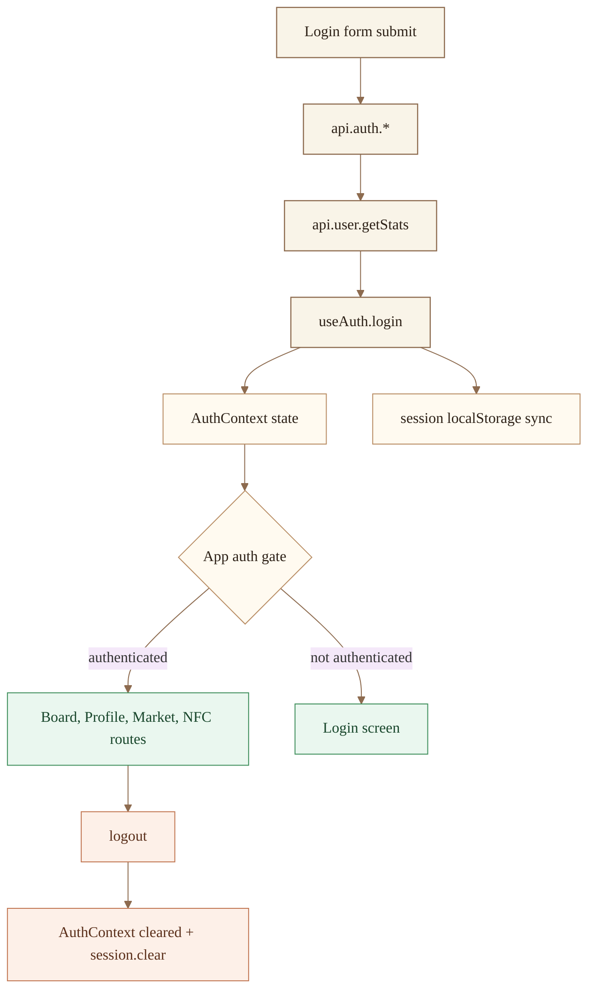
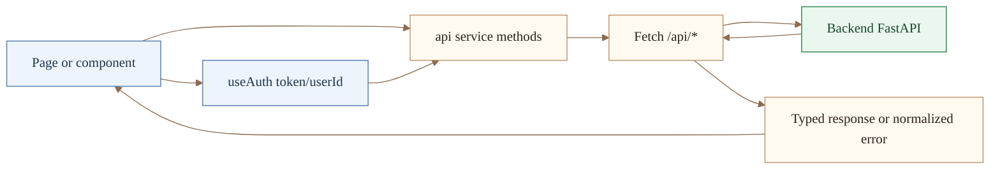
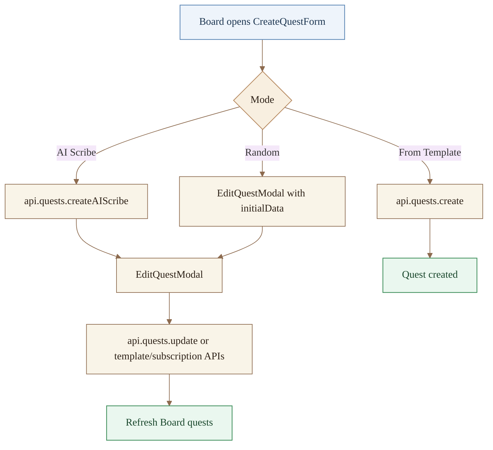
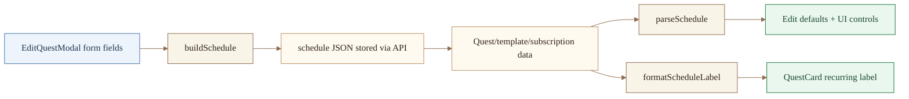

# Frontend

React + Vite client for Majordomo.

Last verified: 2026-02-15

## Run locally

```bash
bun install
bun run dev
```

Dev server: `http://localhost:3000`

## Cloudflare Dev (Auto Tunnels)

Start both quick tunnels and frontend dev server with one command:

```bash
bun run dev:cloudflare
```

What it does automatically:
- opens tunnel to `http://localhost:3000` for frontend
- opens tunnel to `http://localhost:8000` for backend
- waits for both `https://*.trycloudflare.com` URLs
- starts `bun run dev` with:
  - `HMR_HOST=<frontend tunnel host>`
  - `VITE_API_URL=<backend tunnel url>`

Prerequisite: backend API is already running locally on `http://localhost:8000`.

Optional overrides:

```bash
FRONTEND_PORT=3000 BACKEND_PORT=8000 bun run dev:cloudflare
```

## Quality checks

```bash
bun run lint
bun run typecheck
bun run build
```

## App structure

- `src/App.tsx`: routing shell + auth gate
- `src/pages/Board.tsx`: current/upcoming quest views
- `src/pages/Profile.tsx`: user progression/status
- `src/pages/Market.tsx`: reward purchasing
- `src/pages/NFCTrigger.tsx`: trigger flow
- `src/components/`: UI building blocks and forms
- `src/services/api.ts`: backend API client
- `src/types/api.ts`: API types

## Routes

- `/board`
- `/profile`
- `/market`
- `/trigger/quest/:questTemplateId`
- `/playground` (UI/dev)

## API wiring

`src/services/api.ts` resolves base URL using:
- `VITE_API_URL` if set (auto-appends `/api` when missing)
- else browser host with port `8000` and `/api`

## Frontend Flow Diagrams

### Auth and session lifecycle



### App request/data flow



### Quest creation and edit flow



### Recurrence/schedule flow



## Beautiful Mermaid (Optional SVG Export)

If you want richer static diagrams than markdown Mermaid rendering, use `beautiful-mermaid` to generate SVG:

```ts
import { renderMermaid, THEMES } from "beautiful-mermaid";

const svg = await renderMermaid(
  `flowchart TD; A[Login] --> B[Token issued] --> C[Board]`,
  THEMES["catppuccin-latte"]
);
```
