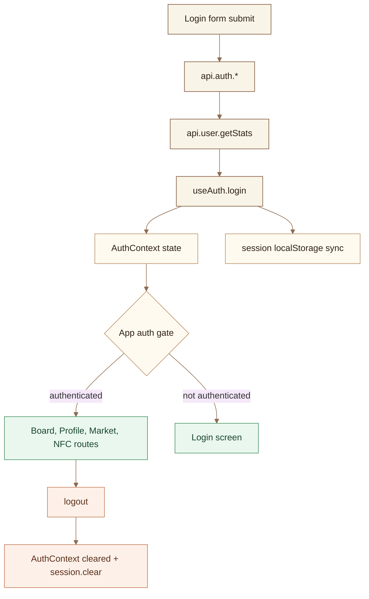
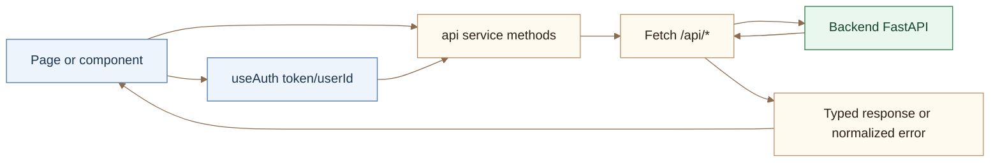
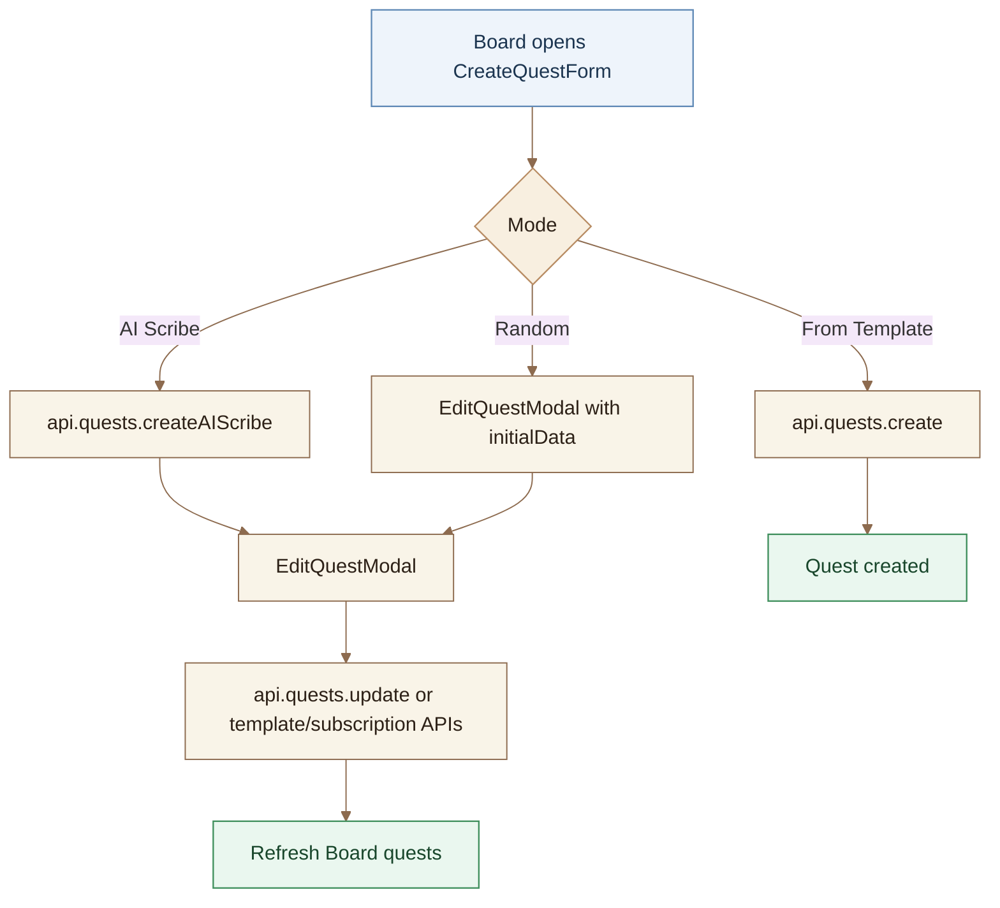
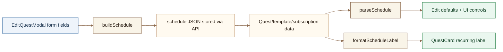

# Frontend

React + Vite client for Majordomo.

Last verified: 2026-04-29

## Run locally

```bash
bun install
bun run dev
```

Dev server: `http://localhost:3000`

## Cloudflare Dev (Auto Tunnels)

Start both quick tunnels and frontend dev server with one command:

```bash
bun run dev:cloudflare
```

What it does automatically:
- opens tunnel to `http://localhost:3000` for frontend
- opens tunnel to `http://localhost:8000` for backend
- waits for both `https://*.trycloudflare.com` URLs
- starts `bun run dev` with:
  - `HMR_HOST=<frontend tunnel host>`
  - `VITE_API_URL=<backend tunnel url>`

Prerequisite: backend API is already running locally on `http://localhost:8000`.

Optional overrides:

```bash
FRONTEND_PORT=3000 BACKEND_PORT=8000 bun run dev:cloudflare
```

## Quality checks

```bash
bun run lint
bun run typecheck
bun run build
```

## Local UI verification with `playwright-cli`

Use `playwright-cli` for quick manual verification after frontend changes, especially for
layout, sort/filter behavior, modal flows, and other UI interactions that are faster to check in
a real browser than by inspection alone.

Recommended setup on this WSL machine:

- install `@playwright/cli` globally
- install a Playwright-managed browser with `playwright-cli install-browser firefox`
- prefer `--browser=firefox` for Codex-driven checks to avoid depending on a system Chrome install

Typical local loop:

```bash
# Terminal 1
bun run dev -- --host 127.0.0.1 --port 3000

# Terminal 2
playwright-cli -s=majordomo-ui open http://127.0.0.1:3000/board --browser=firefox
playwright-cli -s=majordomo-ui snapshot
playwright-cli -s=majordomo-ui click <ref>
playwright-cli -s=majordomo-ui select <ref> <value>
playwright-cli -s=majordomo-ui close
```

Notes:

- If port `3000` is busy, start Vite on another local port and open that URL instead.
- For app flows that need the real API, run the backend locally too.
- For quick browser-driven checks, `playwright-cli` is preferred over writing a one-off test.

## Playwright tests

For repeatable end-to-end tests, use the repo-local Playwright test setup instead of the global
CLI:

```bash
bun run test:e2e
```

Use the global `playwright-cli` for interactive verification and the repo-local test runner for
checked-in automated tests.

## App structure

- `src/App.tsx`: routing shell + auth gate
- `src/pages/Board.tsx`: current/upcoming quest views
- `src/pages/Profile.tsx`: user progression/status
- `src/pages/Market.tsx`: reward purchasing
- `src/pages/NFCTrigger.tsx`: trigger flow
- `src/components/`: UI building blocks and forms
- `src/services/api.ts`: backend API client
- `src/types/api.ts`: API types

## Routes

- `/board`
- `/profile`
- `/market`
- `/t/:nfcCode`
- `/playground` (UI/dev)

## API wiring

`src/services/api.ts` resolves base URL using:
- `VITE_API_URL` if set (auto-appends `/api` when missing)
- else browser host with port `8000` and `/api`

## Time handling

Treat backend datetimes as UTC in transport and storage. On the frontend, parse API datetime
strings through `src/utils/dateTime.ts`, not raw `Date.parse(...)` or `new Date(apiValue)`, so
SQLite timestamps without an explicit offset are normalized consistently.

Rules:

- Use `parseApiDateTime` for API timestamps.
- Use `formatQuestDateTime(..., { timeZone })` for absolute displayed times.
- Use the household timezone only at display time, not for storage or API payloads.
- Use shared relative-time helpers from `src/utils/dateTime.ts` for deadline/spawn labels and
  related sorting:
  - `describeQuestDeadline`
  - `formatQuestDeadlineLabel`
  - `describeUpcomingSpawn`
  - `formatUpcomingSpawnLabel`
- Keep rounding behavior consistent across views: whole hours/days are floored so compact board
  chips and detail views do not drift.
- Quest corruption deadline is `created_at + due_in_hours`; do not recompute it with separate
  local-time assumptions in individual components.

If a new page needs "time left", "spawns in", or similar quest timing text, add or reuse a shared
helper in `src/utils/dateTime.ts` instead of creating page-local formatting logic.

## Frontend Flow Diagrams

### Auth and session lifecycle


```mermaid
%%{init: {'theme': 'base', 'themeVariables': { 'primaryColor': '#f9f4e8', 'primaryBorderColor': '#8d6b4f', 'lineColor': '#8d6b4f', 'fontFamily': 'Georgia, serif' }}}%%
flowchart TD
  classDef action fill:#f9f4e8,stroke:#8d6b4f,color:#2d2117,stroke-width:1.2px;
  classDef state fill:#fffaf0,stroke:#b88c63,color:#2d2117,stroke-width:1px;
  classDef success fill:#eaf7ef,stroke:#3f8f5c,color:#18462b,stroke-width:1px;
  classDef warning fill:#fdf0e8,stroke:#c17652,color:#5a2f1a,stroke-width:1px;

  A[Login form submit] --> B[api.auth.*]
  B --> C[api.user.getStats]
  C --> D[useAuth.login]
  D --> E[AuthContext state]
  D --> F[session localStorage sync]
  E --> G{App auth gate}
  G -->|authenticated| H[Board, Profile, Market, NFC routes]
  G -->|not authenticated| I[Login screen]
  H --> J[logout]
  J --> K[AuthContext cleared + session.clear]

  class A,B,C,D action;
  class E,F,G state;
  class H,I success;
  class J,K warning;
```

### App request/data flow


```mermaid
%%{init: {'theme': 'base', 'themeVariables': { 'primaryColor': '#f9f4e8', 'primaryBorderColor': '#8d6b4f', 'lineColor': '#8d6b4f', 'fontFamily': 'Georgia, serif' }}}%%
flowchart LR
  classDef source fill:#eef4fb,stroke:#5f89b6,color:#1c3550,stroke-width:1.2px;
  classDef service fill:#fffaf0,stroke:#b88c63,color:#2d2117,stroke-width:1px;
  classDef backend fill:#eaf7ef,stroke:#3f8f5c,color:#18462b,stroke-width:1.2px;

  P[Page or component] --> Q[useAuth token/userId]
  P --> R[api service methods]
  Q --> R
  R --> S[Fetch /api/*]
  S --> T[Backend FastAPI]
  T --> S
  S --> U[Typed response or normalized error]
  U --> P

  class P,Q source;
  class R,S,U service;
  class T backend;
```

### Quest creation and edit flow

`CreateQuestForm` owns the quest participant selection and sends `participant_user_ids` for
AI-scribe and random quests. The UI labels a single participant as "Quest For" and multiple
participants as "Quest Party". Template default editing exposes "New Quest For/Party" inside
`EditQuestModal` so that selection is tied to the quest instance created by "Save Defaults &
Create Quest", not to the template itself. `EditQuestModal` can update the party for active
existing quests; completed quests keep their participant rows so reward history remains stable.


```mermaid
%%{init: {'theme': 'base', 'themeVariables': { 'primaryColor': '#f9f4e8', 'primaryBorderColor': '#8d6b4f', 'lineColor': '#8d6b4f', 'fontFamily': 'Georgia, serif' }}}%%
flowchart TD
  classDef input fill:#eef4fb,stroke:#5f89b6,color:#1c3550,stroke-width:1.2px;
  classDef branch fill:#f8efe0,stroke:#b88c63,color:#2d2117,stroke-width:1.2px;
  classDef action fill:#f9f4e8,stroke:#8d6b4f,color:#2d2117,stroke-width:1px;
  classDef done fill:#eaf7ef,stroke:#3f8f5c,color:#18462b,stroke-width:1.2px;

  A[Board opens CreateQuestForm] --> B{Mode}
  B -->|AI Scribe| C[api.quests.createAIScribe]
  B -->|From Template| D[api.quests.create]
  B -->|Random| E[EditQuestModal with initialData]
  C --> F[EditQuestModal]
  D --> G[Quest created]
  E --> F
  F --> H[api.quests.update or template/subscription APIs]
  H --> I[Refresh Board quests]

  class A input;
  class B branch;
  class C,D,E,F,H action;
  class G,I done;
```

### Recurrence/schedule flow


```mermaid
%%{init: {'theme': 'base', 'themeVariables': { 'primaryColor': '#f9f4e8', 'primaryBorderColor': '#8d6b4f', 'lineColor': '#8d6b4f', 'fontFamily': 'Georgia, serif' }}}%%
flowchart LR
  classDef form fill:#eef4fb,stroke:#5f89b6,color:#1c3550,stroke-width:1.2px;
  classDef compute fill:#f9f4e8,stroke:#8d6b4f,color:#2d2117,stroke-width:1px;
  classDef store fill:#fffaf0,stroke:#b88c63,color:#2d2117,stroke-width:1px;
  classDef output fill:#eaf7ef,stroke:#3f8f5c,color:#18462b,stroke-width:1.2px;

  A[EditQuestModal form fields] --> B[buildSchedule]
  B --> C[schedule JSON stored via API]
  C --> D[Quest/template/subscription data]
  D --> E[parseSchedule]
  E --> F[Edit defaults + UI controls]
  D --> G[formatScheduleLabel]
  G --> H[QuestCard recurring label]

  class A form;
  class B,E,G compute;
  class C,D store;
  class F,H output;
```

## Beautiful Mermaid (Optional SVG Export)

If you want richer static diagrams than markdown Mermaid rendering, use `beautiful-mermaid` to generate SVG:

```ts
import { renderMermaid, THEMES } from "beautiful-mermaid";

const svg = await renderMermaid(
  `flowchart TD; A[Login] --> B[Token issued] --> C[Board]`,
  THEMES["catppuccin-latte"]
);
```
